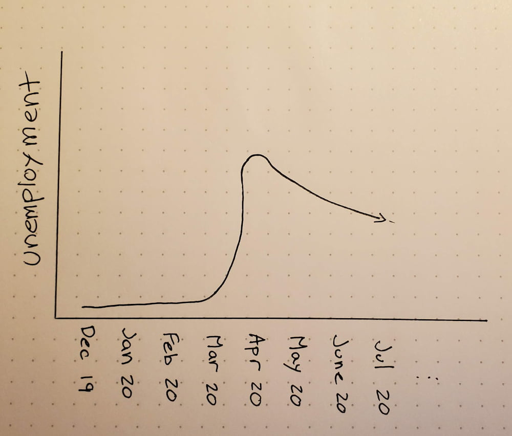

# CS-5630 / CS-6630 - Visualization for Data Science Homework 1
Jakob Johnson, [jakobottar@pm.me](mailto:jakobottar@pm.me), u0976273

## Problem 1: Job Losses and Gains

### Critique
1. The data being represented are changes in nonfarm employment vs the previous month. 
2. This visualization shows how many jobs were lost during the early months of the COVID-19 pandemic and that many were then brought back in May. 
3. The graph is very effictive at showing the magnitude of the employment drop in April. 
4. Where the numbers come from is hard to pick out, meaning it's hard to tell whether we gained 2.5M jobs in May or 23.2M jobs. 
5. I do not like this graph because since the May statistic jumps up to positive 2.5 from -20.7M, it appears that we fully recovered and even gained jobs when in reality we are still -18.2M from Feb 2020. 

### Redesign

I redesigned the figure plotting unemployment vs month. This better shows that the job market has not nearly recovered though it is improving. It retains the "magnitude" of the April job losses but us more clear about the subsequent month's recovery. 

You could also make a plot showing total nonfarm workers and show how much it dips in April. This would show the dip in relation to the entire economy and would (I imagine) lessen the "magnitude" and shock factor. 

## Problem 2: Choose Your Own
I chose this graphic:

I found it here: [https://www.reddit.com/r/dataisbeautiful/comments/ik06ml/oc_average_winning_speed_in_cyclings_3_grand/](https://www.reddit.com/r/dataisbeautiful/comments/ik06ml/oc_average_winning_speed_in_cyclings_3_grand/)

This graph shows the average speed of the "Grand Tours", three famous European 3-week bike races, the Tour de France, the Giro d'Italia, and the Vuelta a España. Reading into the data, we can see the huge average speed increases over the years, caused mostly by technological improvements with some peaks caused by doping. 

The visualization answers questions about how much faster grand tours have gotten, and how the speeds of the different tours compare to each other. 

I like that the running average is shown, it makes the trends really easy to follow. I also like the choice of color scheme. While it may not be the most aesthetically pleasing, each color represents the leader's jersey color for the race. This makes it easy to read which tour is which even without a legend (if you're a cycling fan). 

I don't like how little background info is shown on the plot. I learned after seeing this that the reason the Vuelta is so fast in the 70's was because the races were really flat through comments and other research. I also already know that the 90's and 00's are fast because the winners (and most of the contenders) were doping, allowing them to go faster. Including this information in the plot would make it more interesting and easier to read if you're not a cycling fan. 

I like this visualization because I'm interested in the subject and how much faster bike races have gotten. I don't like how it leaves out a lot of context. I would change it by accounting for elevation, as climbing slows down the average speed significantly, and marking which years dopers won. Alternatively, adding info about technological advancements would be really great. 

In both of these, I only drew the average line. In the real visualization we would change the dot to a triangle for wins that were retroactively removed for doping. Ideally we could have it be interactive and have more information about the race when you mouse over the race's icon.

